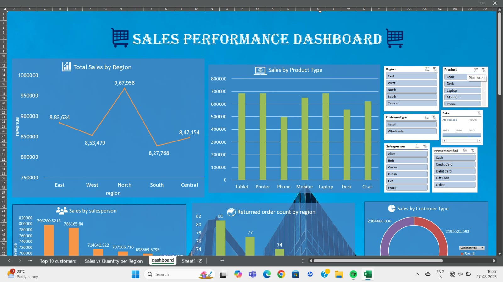
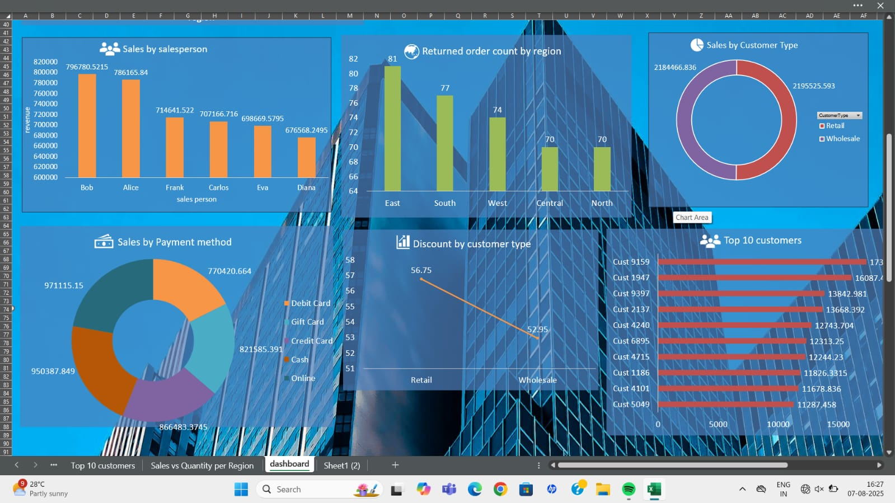
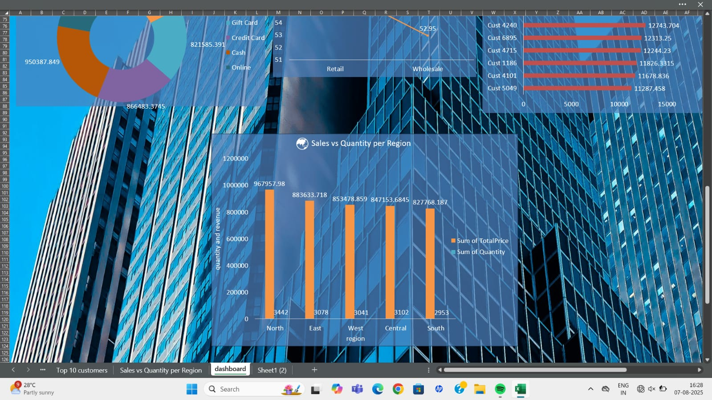

# Sales Performance Analysis (Excel)

## Overview
An end-to-end sales performance analysis built entirely in Excel, covering 1,500+ transactions across 5 regions, 7 product types, 6 salespeople, and multiple customer/payment segments. The project uses PivotTables, slicers, and dynamic charts to build a fully interactive, filterable dashboard.

## Business Questions Answered
- Which regions and products generate the most revenue?
- How does performance compare between Retail and Wholesale customers?
- Who are the top-performing salespeople?
- Which regions have the highest return rates?
- Which payment methods are most commonly used?
- Who are the top 10 customers by total spend?
- How does revenue relate to quantity sold across regions?

## Dashboard

The dashboard is fully interactive, with slicers allowing filtering by **Region, Product, Customer Type, Salesperson, Payment Method, and Date (2023-2025)**.

Additional dashboard views:

## Key Insights
- **North region leads in revenue** (₹9,67,958), despite East having a comparable transaction volume — indicating higher average order values in the North.
- **Tablets and Printers are the top revenue-generating product categories**, each contributing roughly ₹6.8L, notably ahead of Phones and other categories.
- **Retail and Wholesale customers contribute almost equally** to total revenue (₹21.96L vs ₹21.84L), suggesting a balanced customer base rather than dependency on one segment.
- **East region has the highest return count (81 orders)**, notably higher than Central and North (70 each) — worth investigating for potential fulfillment or product quality issues specific to that region.
- **Online and Cash are the most-used payment methods** by revenue share, ahead of Credit Card, Gift Card, and Debit Card.
- **Bob and Alice are the top-performing salespeople**, each generating close to ₹7.9L in sales, notably ahead of the rest of the team.
- **Revenue and quantity sold are consistent across regions** — North leads in both total revenue and units sold (3,442 units), confirming its top position isn't just from higher-priced items.

See [insights.md](insights.md) for the full write-up.

## Tools Used
Excel — PivotTables, Slicers, Dynamic Charts, Interactive Dashboard Design

## Files
- `sales_project.xlsx` — raw transaction data, 9 pivot table views, and the interactive dashboard sheet
- `insights.md` — detailed findings and business recommendations